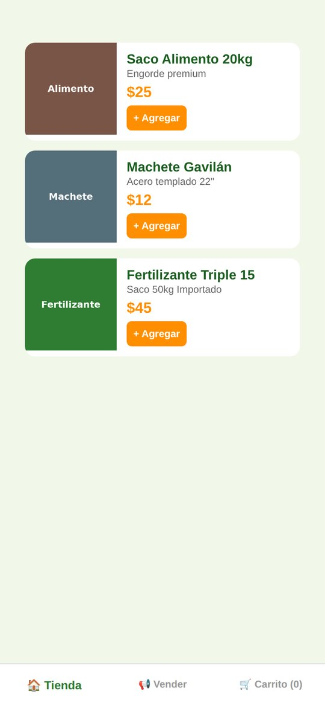
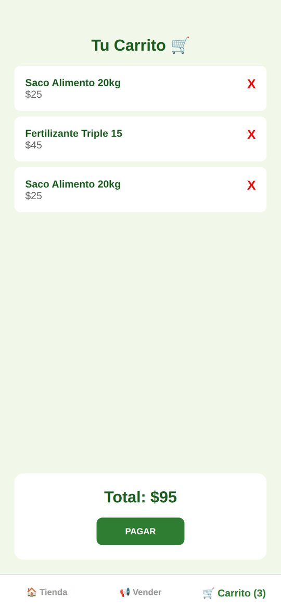
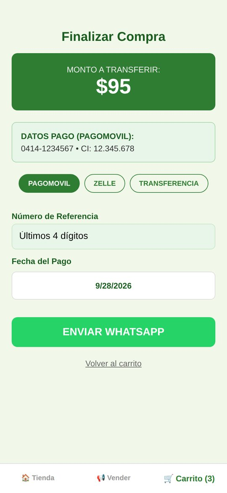
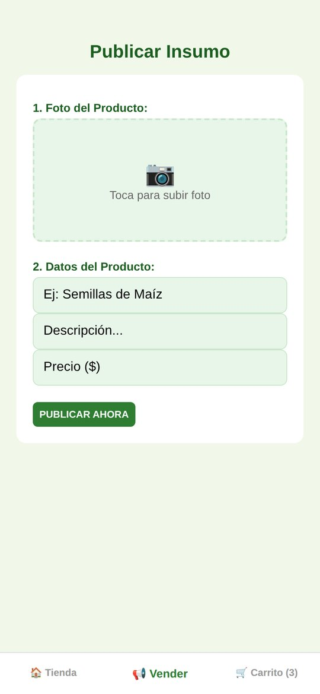

# 🌱 Agro Market — Tienda móvil de insumos agrícolas

App móvil para vender insumos del campo (alimento, herramientas, fertilizantes). El cliente arma su carrito, registra el pago y el pedido llega directo al **WhatsApp del negocio**; el vendedor publica productos nuevos con foto desde el teléfono.


---

## 📸 Capturas

<p align="center">
  
  
  
  
</p>
<p align="center"><sub>Catálogo · Carrito · Pago y pedido por WhatsApp · Publicar producto</sub></p>

---

## ✨ Funcionalidades

- 🏠 **Tienda**: catálogo de productos con imagen, precio y botón de compra.
- 🛒 **Carrito**: cantidades, total a pagar y finalización de compra.
- 💳 **Registro de pago**: método (Pago Móvil / transferencia), número de referencia y fecha con selector nativo.
- 💬 **Pedido por WhatsApp**: genera el mensaje con el detalle del pedido y lo abre en WhatsApp con un toque.
- 📢 **Vender**: publicar insumos nuevos con **foto de la galería** (`expo-image-picker`).
- 💾 Persistencia local del inventario con `AsyncStorage`.

## 🚀 Cómo ejecutarlo

```bash
npm install
npx expo start          # escanea el QR con Expo Go
```

Configura el número del negocio en `app/(tabs)/index.tsx` → `NUMERO_WHATSAPP` (formato internacional, sin `+`).

### Probar sin compilar (Expo Go)

Instala **Expo Go** desde Play Store / App Store, ejecuta `npx expo start` y escanea el QR.

## 📦 Generar el APK para instalar en Android

No necesitas Android Studio: el APK se compila gratis en la nube con **EAS Build** de Expo.

```bash
npm install -g eas-cli        # una sola vez
eas login                     # cuenta gratis en expo.dev
eas build:configure           # solo la primera vez (vincula el proyecto a TU cuenta)
eas build -p android --profile preview
```

Al terminar (10-20 min) EAS muestra un **enlace y un código QR** para descargar el `.apk`; ábrelo en el teléfono e instálalo (permite "orígenes desconocidos").

> Si `eas build` da error de permisos, borra en `app.json` las claves `"owner"` y `"extra.eas.projectId"` (pertenecen a la cuenta del autor) y vuelve a ejecutar `eas build:configure`.

| Opción | Comando | Resultado |
|---|---|---|
| APK para instalar directo | `eas build -p android --profile preview` | `.apk` |
| Publicar en Google Play | `eas build -p android --profile production` | `.aab` |
| Compilar en tu PC (requiere Android Studio) | `npx expo run:android --variant release` | `.apk` local |

## 👤 Autor

**Dominic De Freitas** — [GitHub](https://github.com/dominic0285) · [LinkedIn](https://www.linkedin.com/in/dominic-de-freitas-07102828a/)
